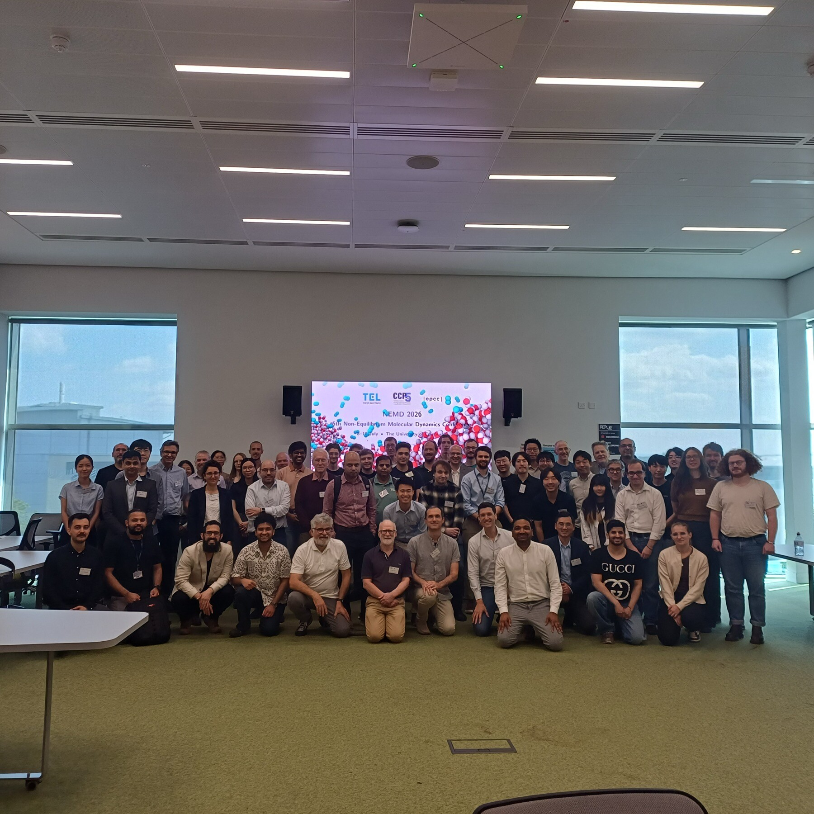
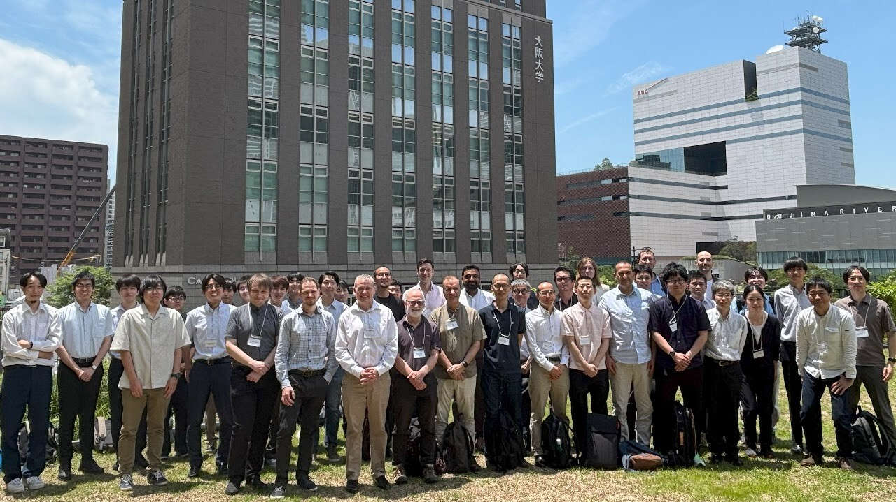
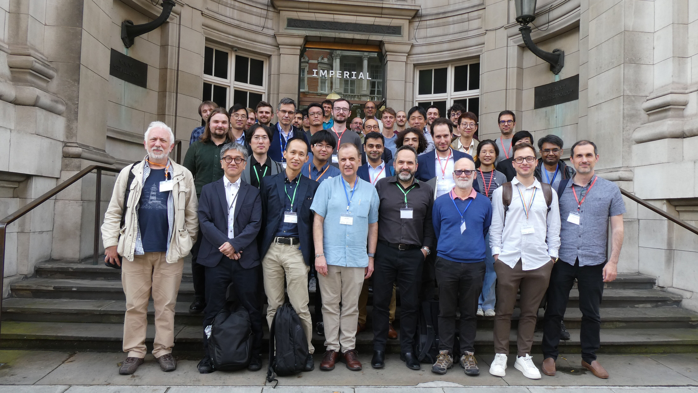
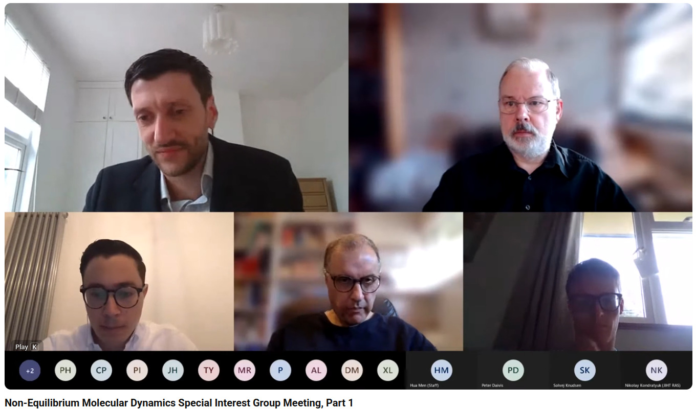
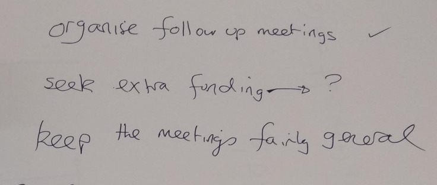

```{=html}
<div class="wrap">
<p class="intro">The NEMD conference series has met five times since 2020, in the UK, online, and in Japan. Each meeting has its own page with dates, organisers, and materials.</p>

<ol class="confs">
  <li class="conf">
    <div class="mk" aria-hidden="true">5</div>
    <div>
      <h2><a href="conferences/nemd-2026.html">NEMD 2026 &middot; Edinburgh</a></h2>
      <p class="meta">5th conference &middot; 8&ndash;10 July 2026 &middot; The Nucleus, University of Edinburgh</p>
      <p>The 5th and largest meeting yet: 5 keynotes, 24 talks, 15 posters, 76 delegates from 15 countries, and the first summer school.</p>
    </div>
    <figure class="print"><figcaption>NEMD 2026 delegates at the Nucleus, King's Buildings.</figcaption></figure>
  </li>
  <li class="conf">
    <div class="mk" aria-hidden="true">4</div>
    <div>
      <h2><a href="conferences/nemd-2025.html">NEMD 2025 &middot; Osaka</a></h2>
      <p class="meta">4th conference &middot; 11&ndash;13 June 2025 &middot; Osaka University Nakanoshima Center</p>
      <p>The 4th meeting and the first outside the UK, hosted at Osaka University Nakanoshima Center.</p>
    </div>
    <figure class="print"><figcaption>NEMD 2025 at Osaka University Nakanoshima Center.</figcaption></figure>
  </li>
  <li class="conf">
    <div class="mk" aria-hidden="true">3</div>
    <div>
      <h2><a href="conferences/nemd-2024.html">NEMD 2024 &middot; London</a></h2>
      <p class="meta">3rd conference &middot; 13&ndash;14 June 2024 &middot; Imperial College London</p>
      <p>The 3rd meeting: two days of talks and poster sessions at Imperial College London.</p>
    </div>
    <figure class="print"><figcaption>NEMD 2024 at Imperial College London.</figcaption></figure>
  </li>
  <li class="conf virtual">
    <div class="mk" aria-hidden="true">2</div>
    <div>
      <h2><a href="conferences/nemd-2021.html">NEMD 2021 &middot; Online</a></h2>
      <p class="meta">2nd meeting &middot; 6 September 2021 &middot; Online</p>
      <p>The online meeting, with full session recordings available on YouTube.</p>
    </div>
    <figure class="print"><figcaption>NEMD 2021, held online over Microsoft Teams.</figcaption></figure>
  </li>
  <li class="conf">
    <div class="mk" aria-hidden="true">1</div>
    <div>
      <h2><a href="conferences/nemd-2020.html">NEMD 2020 &middot; London</a></h2>
      <p class="meta">1st meeting &middot; 17 January 2020 &middot; Brunel University London</p>
      <p>The kick-off meeting at Brunel University London that started the series.</p>
    </div>
    <figure class="print"><figcaption>Notes from the discussion session at the first meeting, 17 January 2020</figcaption></figure>
  </li>
</ol>
</div>
```
