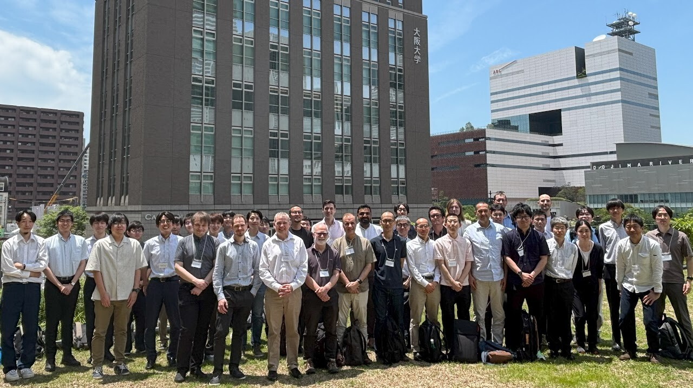

```{=html}
<p class="event-meta">4th conference &middot; 11&ndash;13 June 2025 &middot; Osaka University Nakanoshima Center</p>
```

The fourth meeting and the first outside the UK. Chaired by Yasutaka Yamaguchi (Osaka University), with vice chairs Takeshi Omori and Takuya Kuwahara (Osaka Metropolitan University), the meeting was supported by the Japan Society for the Promotion of Science as a UK-Japan collaborative initiative, with refreshments sponsored by Tokyo Electron.

More detail is on the [NEMD 2025 conference site](https://sites.google.com/view/nemd2025-japan/home).

```{=html}
<div class="event-photo"></div>
<p class="photo-credit">NEMD 2025 at Osaka University Nakanoshima Center.</p>
```
