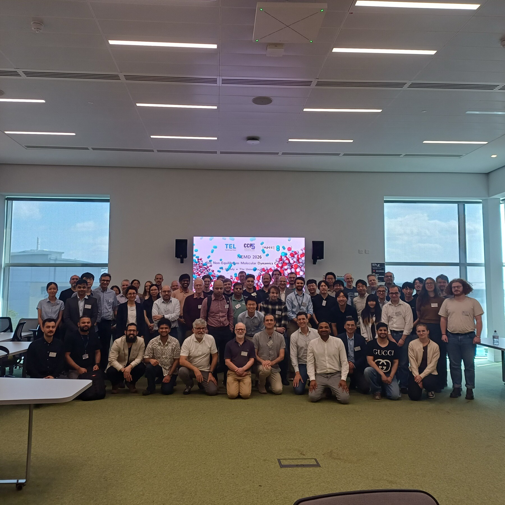
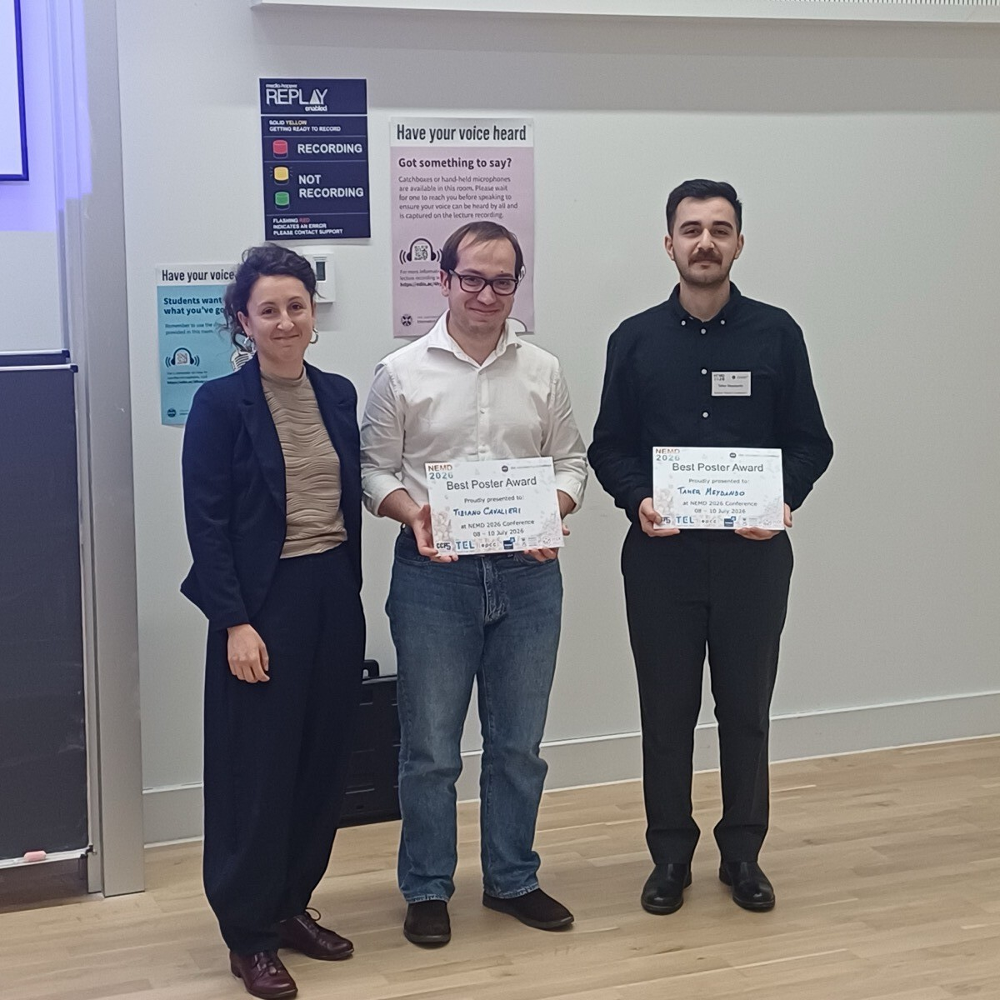

```{=html}
<p class="event-meta">5th conference &middot; 8&ndash;10 July 2026 &middot; The Nucleus, University of Edinburgh</p>
```

The fifth meeting was the largest yet: 76 delegates from 15 countries across 4 continents, with 5 keynotes, 24 talks in total, and 15 posters presented through lightning-talk sessions. It was also the first meeting with a [summer school](../summer-school.html), held on the two days before the conference.

For the full timetable, see the [conference programme (PDF)](../files/NEMD2026_Programme.pdf).

```{=html}
<div class="event-photo"></div>
<p class="photo-credit">NEMD 2026 delegates at the Nucleus, King's Buildings.</p>
```

## Best Poster Award

Voted by the delegates, the award was shared by two posters:

- Tiziano Cavalieri (University of Edinburgh), "A Non-Equilibrium Approach to Molecular Modelling of Gas Transport in a Mixed Matrix Membrane"
- Taher Meydando (University of Edinburgh), "Determination of Nanobubble Zeta Potential via Non-Equilibrium Molecular Dynamics"

```{=html}
<div class="event-photo"></div>
<p class="photo-credit">Poster prize winners Tiziano Cavalieri and Taher Meydando with committee member Eleonora Ricci.</p>
```

## Organisation

Organised by Rohit Pillai (chair), Duncan Dockar, Eleonora Ricci, and Santiago Romero-Vargas Castrillón (University of Edinburgh), Saikat Datta (Swansea University), and Edward Smith (Brunel University London).

Sponsored by CCP5, Tokyo Electron Ltd., EPCC, Brunel University London, Swansea University, and the Multiscale Flow X group.
