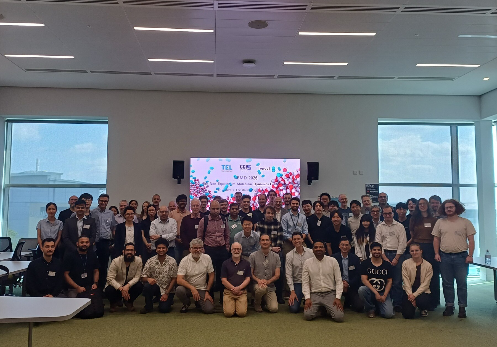

```{=html}
<section class="hero-photo">
  <div class="overlay"></div>
  <div class="hero-text">
    <div class="hero-h1">Non-Equilibrium Molecular Dynamics</div>
    <p class="def">The community for molecular simulation of fluids driven away from equilibrium: flows, thermal gradients, and interfaces. Meeting since 2020, worldwide.</p>
  </div>
  
  <span class="caption">NEMD 2026, Edinburgh</span>
</section>

<div class="ticker">
  <div class="t"><span class="n">5</span><span class="l">conferences</span></div>
  <div class="t"><span class="n">2</span><span class="l">continents</span></div>
  <div class="t"><span class="n">76</span><span class="l">delegates in 2026</span></div>
  <div class="t"><span class="n">15</span><span class="l">countries</span></div>
  <div class="t"><span class="n">2026</span><span class="l">first summer school</span></div>
</div>

<section class="series">
  <div class="kicker">The series</div>
  <div class="rail">
    <div class="tl-row"><span class="yr">2020</span><span class="what"><a href="conferences/nemd-2020.html">1st meeting, Brunel University London</a>: the series starts under the UK Fluids Network special interest group</span></div>
    <div class="tl-row"><span class="yr">2021</span><span class="what"><a href="conferences/nemd-2021.html">2nd meeting, online</a>, with full recordings</span></div>
    <div class="tl-row"><span class="yr">2024</span><span class="what"><a href="conferences/nemd-2024.html">3rd conference, Imperial College London</a></span></div>
    <div class="tl-row"><span class="yr">2025</span><span class="what"><a href="conferences/nemd-2025.html">4th conference, Osaka</a>: the first outside the UK</span></div>
    <div class="tl-row"><span class="yr">2026</span><span class="what"><a href="conferences/nemd-2026.html">5th conference, Edinburgh</a>: the largest yet, and the first with a <a href="summer-school.html">summer school</a></span></div>
    <div class="tl-row future"><span class="yr">Next</span><span class="what">To be announced; the mailing list hears first</span></div>
  </div>
</section>

<section class="band-light">
  <h2>Stay in touch</h2>
  <p>Announcements about future meetings go to the mailing list first. To join, email contact.nemd@gmail.com with the subject line "subscribe".</p>
  <a class="cta" href="mailto:contact.nemd@gmail.com?subject=subscribe">Join the mailing list</a>
</section>
```
