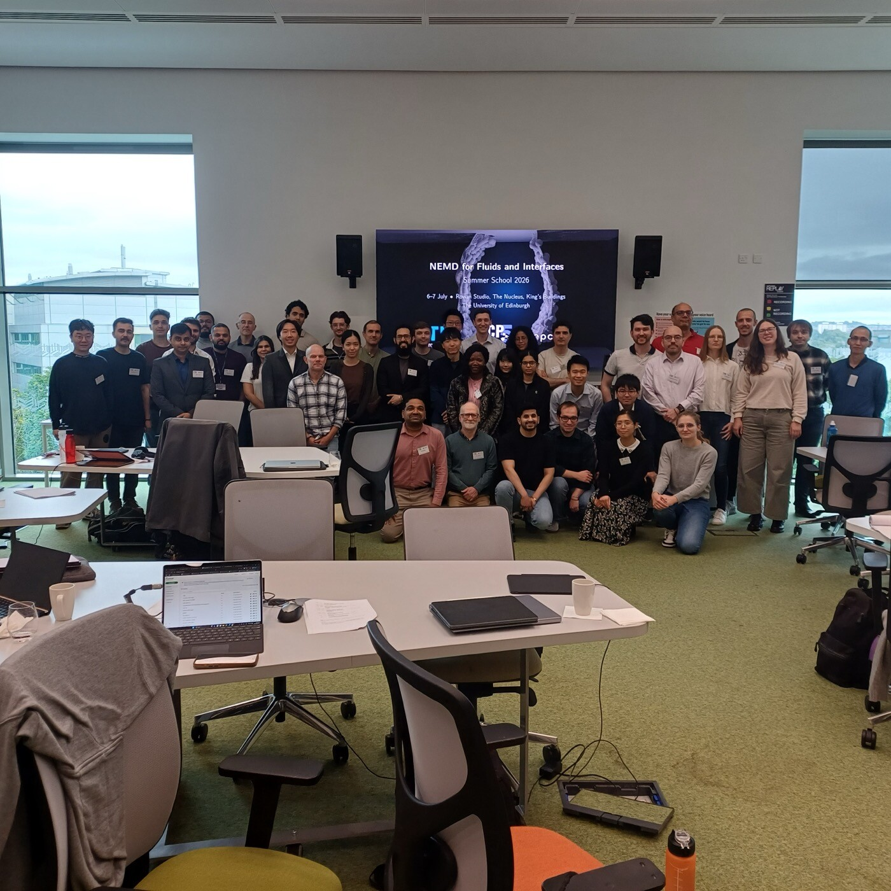

```{=html}
<p class="event-meta">NEMD for Fluids and Interfaces &middot; 6&ndash;7 July 2026 &middot; University of Edinburgh</p>
```

The first NEMD summer school ran over the two days before NEMD 2026, with 39 participants. Ten lectures covered NEMD theory and methods for fluids and interfaces, paired with hands-on sessions running LAMMPS on the Cirrus supercomputer with EPCC support.

- School website: [nemd-school.org](https://nemd-school.org)
- Hands-on materials (LAMMPS + Python, open to all): [github.com/Non-Equilibrium-Molecular-Dynamics/NEMD-Summer-School-2026](https://github.com/Non-Equilibrium-Molecular-Dynamics/NEMD-Summer-School-2026)

```{=html}
<div class="event-photo"></div>
<p class="photo-credit">The 2026 summer school at the Nucleus, King's Buildings.</p>
```
